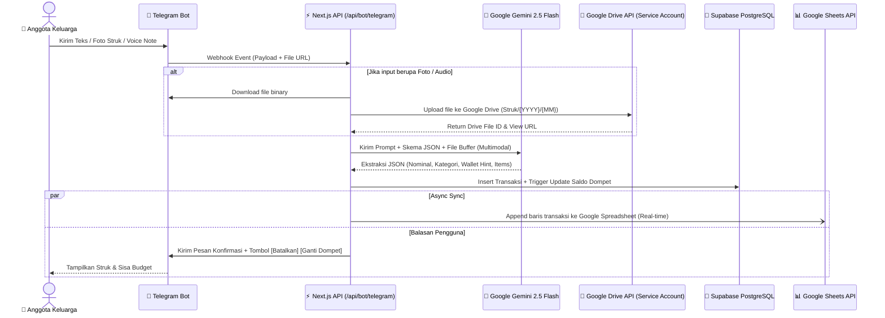
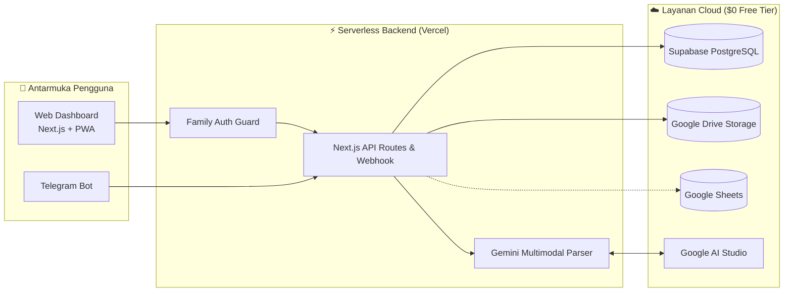

# 🏡 F&R Family Hub — System Architecture & Implementation Plan

Dokumen perencanaan dan desain arsitektur aplikasi manajemen keluarga terpadu (**F&R Family Hub**) dengan antarmuka **Web Dashboard** dan **Omnichannel Bot (Telegram First)** bertenaga **Google Gemini AI**, **Supabase Database**, **Google Drive Storage**, dan **Real-Time Google Sheets Sync**.

---

## 📑 Daftar Isi
1. [Ringkasan Eksekutif](#1-ringkasan-eksekutif)
2. [Keputusan Arsitektur Terpilih (Hasil Grilling)](#2-keputusan-arsitektur-terpilih-hasil-grilling)
3. [Alur Kerja AI & Omnichannel Pipeline](#3-alur-kerja-ai--omnichannel-pipeline)
4. [Integrasi Google Drive & Real-Time Google Sheets](#4-integrasi-google-drive--real-time-google-sheets)
5. [Rekomendasi Tech Stack ($0 / 100% Free Tier)](#5-rekomendasi-tech-stack-0--100-free-tier)
6. [Arsitektur Sistem & Diagram](#6-arsitektur-sistem--diagram)
7. [Tahapan Implementasi (Roadmap MVP)](#7-tahapan-implementasi-roadmap-mvp)

---

## 1. Ringkasan Eksekutif

**F&R Family Hub** adalah platform asisten dan manajemen kebutuhan rumah tangga yang dirancang untuk menyederhanakan pencatatan dan monitoring berbagai aspek kehidupan keluarga:
- **Input Cepat Tanpa Buka Aplikasi**: Anggota keluarga cukup mengirim pesan teks, foto struk belanjaan, atau *voice note* ke Bot Telegram.
- **Pemrosesan Cerdas (LLM Gemini 2.5/1.5 Flash)**: AI membedah struk, mentranskripsi audio voice note, mengekstrak kategori/nominal, dan menyimpannya secara terstruktur.
- **Penyimpanan Foto di Google Drive**: Seluruh foto nota dan berkas dokumen langsung terunggah ke Google Drive keluarga melalui Service Account.
- **Live Sync Google Sheets**: Transaksi otomatis tereplikasi secara *real-time* ke Google Spreadsheet untuk kemudahan audit di smartphone.
- **Web Dashboard Terpadu**: Visualisasi cashflow bulanan, status aset, simulasi hutang/cicilan, jadwal servis & utilitas rumah, serta brankas digital dokumen legal keluarga.
- **Efisiensi Biaya Maksimal**: 100% beroperasi pada **Free Tier ($0/bulan)**.

---

## 2. Keputusan Arsitektur Terpilih (Hasil Grilling)

| Aspek Desain | Keputusan yang Disepakati | Rujukan ADR |
| :--- | :--- | :--- |
| **Pola Simpan Bot** | **Optimistic Insert**: Data langsung disimpan ke DB saat itu juga. Bot membalas dengan ringkasan + tombol inline `[Batalkan]` `[Ganti Dompet]` `[Ubah Kategori]`. | [ADR 004](file:///d:/Fatih%20Data/Project/Own/F&R%20App/docs/adr/004-bot-interaction-and-wallet-fallback.md) |
| **Struk Belanja Multi-Item** | Disimpan sebagai **1 transaksi utama** (Kategori: Belanja Bulanan) dengan rincian item lengkap di kolom `parsed_metadata (JSONB)`. | [ADR 004](file:///d:/Fatih%20Data/Project/Own/F&R%20App/docs/adr/004-bot-interaction-and-wallet-fallback.md) |
| **Fallback Dompet/Rekening** | **Per-Member Default Wallet**: Otomatis mengarah ke dompet utama masing-masing anggota (Ayah -> BCA, Ibu -> Mandiri, Anak -> Dompet Tunai), dengan tombol ganti cepat. | [ADR 004](file:///d:/Fatih%20Data/Project/Own/F&R%20App/docs/adr/004-bot-interaction-and-wallet-fallback.md) |
| **Penyimpanan Foto Struk/Dokumen** | **Google Drive Shared Folder** via Google Service Account (Struktur: `F&R Family Hub/Struk/{YYYY}/{MM}/`) dengan izin akses link untuk preview di Web/Bot. | [ADR 003](file:///d:/Fatih%20Data/Project/Own/F&R%20App/docs/adr/003-google-drive-and-sheets-integration.md) |
| **Sinkronisasi Spreadsheet** | **Real-Time Instant Append**: Baris transaksi baru langsung otomatis ditambahkan ke Google Spreadsheet setiap kali transaksi masuk. | [ADR 003](file:///d:/Fatih%20Data/Project/Own/F&R%20App/docs/adr/003-google-drive-and-sheets-integration.md) |
| **Prioritas Bot Messaging** | **Telegram Bot API** sebagai first-class citizen pada MVP (100% stabil, audio native OGG Opus, gratis tanpa batas). | [ADR 002](file:///d:/Fatih%20Data/Project/Own/F&R%20App/docs/adr/002-telegram-bot-and-gemini-multimodal.md) |

---

## 3. Alur Kerja AI & Omnichannel Pipeline



---

## 4. Integrasi Google Drive & Real-Time Google Sheets

### 📁 Struktur Folder Google Drive
```
F&R Family Hub/
├── 🧾 Struk & Nota/
│   └── 2026/
│       ├── 08/
│       │   ├── 2026-08-31_Indomaret_55000.jpg
│       │   └── 2026-08-31_Shell_150000.jpg
│       └── 09/
└── 📑 Brankas Dokumen Legal/
    ├── Identitas/ (KTP, KK, Paspor)
    ├── Kendaraan/ (STNK, BPKB)
    └── Properti/ (Sertifikat, PBB)
```

### 📊 Format Baris Google Sheets (Real-Time Append)
| Timestamp | Tanggal | Tipe | Kategori | Nominal (Rp) | Dompet / Sumber | Deskripsi / Catatan | Dicatat Oleh | Link Foto GDrive |
| :--- | :--- | :--- | :--- | :--- | :--- | :--- | :--- | :--- |
| `31/08/2026 15:30` | `2026-08-31` | Pengeluaran | Belanja Bulanan | `55.000` | BCA | Belanja Roti & Susu | Ayah | [Buka Foto](https://drive.google.com/...) |

---

## 5. Rekomendasi Tech Stack ($0 / 100% Free Tier)

| Komponen | Pilihan Teknologi | Biaya | Alasan Pemilihan |
| :--- | :--- | :--- | :--- |
| **Frontend & Backend** | **Next.js 15 (App Router, TypeScript, Tailwind CSS, Shadcn UI)** | **$0** (Vercel Hobby) | Single codebase modern, serverless API routes, dan antarmuka responsif. |
| **Primary Database & RLS** | **Supabase (PostgreSQL + Triggers + RLS)** | **$0** (Free Tier: 500MB DB) | Transaksi ACID aman, trigger saldo otomatis, dan relasi multi-tabel kuat. |
| **AI Multimodal Engine** | **Google Gemini 2.5 Flash / 1.5 Flash** | **$0** (Free Tier: 15 RPM) | Ekstraksi teks, OCR foto struk, dan transkripsi audio native dalam 1 model. |
| **Media & File Storage** | **Google Drive API (via Service Account)** | **$0** (15GB Free Google Drive) | Folder bersama keluarga, preview langsung di Web & Bot. |
| **Live Backup / Spreadsheet** | **Google Sheets API** | **$0** (Google Cloud Free) | Sinkronisasi real-time instan untuk akses data di mobile spreadsheet. |
| **Bot Messaging Primary** | **Telegram Bot API** | **$0** (Resmi & Unlimited) | Cepat, stabil, mendukung audio note & foto tanpa kompresi rusak. |

---

## 6. Arsitektur Sistem & Diagram



---

## 7. Tahapan Implementasi (Roadmap MVP)

### 🚀 Sprint 1: Fondasi Finansial, Bot Telegram, & Google Integration
- [ ] Setup project Next.js + TypeScript + Tailwind + Shadcn UI.
- [ ] Setup koneksi Supabase & inisialisasi skema tabel via `docs/database-schema-supabase.sql`.
- [ ] Setup Google Cloud Service Account (Google Drive API & Google Sheets API).
- [ ] Endpoint Webhook Telegram `/api/bot/telegram` + integrasi Gemini Flash parser.
- [ ] Upload foto struk ke Google Drive + Append baris transaksi ke Google Sheets secara real-time.
- [ ] Web Dashboard Keuangan (Ringkasan saldo, grafik cashflow bulanan, list transaksi, tombol filter).

### 🏠 Sprint 2: Manajemen Aset, Hutang, & Utilitas Rumah
- [ ] Modul Aset & Portofolio (Emas, properti, kendaraan).
- [ ] Modul Hutang & Cicilan (Tracking sisa pokok, simulasi pelunasan).
- [ ] Modul Rumah & Utilitas (PLN, PDAM, Internet, log servis berkala).

### 📑 Sprint 3: Brankas Dokumen Digital & WhatsApp Bot
- [ ] Modul Brankas Dokumen Legal (Upload PDF/Foto ke Google Drive Dokumen).
- [ ] Bot Notification Reminder (Jadwal perpanjangan STNK, SIM, PBB, & Tagihan Rumah).
- [ ] Integrasi WhatsApp Bot (Gateway Baileys / Cloud API).
