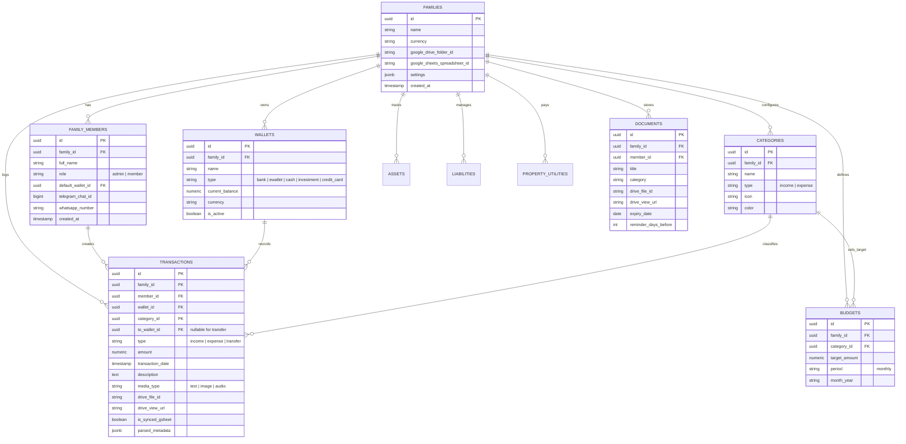

# 📖 Glosarium Domain & Model Data (Domain Modeling)

Dokumen ini mendefinisikan bahasa bersama (*Ubiquitous Language*) dan pemodelan entitas untuk sistem **F&R Family Hub**.

---

## 1. Glosarium Domain (Ubiquitous Language)

| Istilah | Definisi |
| :--- | :--- |
| **Family (Keluarga)** | Unit tenant utama dalam sistem. Seluruh data keuangan, anggaran, aset, dan dokumen terikat pada satu `family_id`. |
| **Family Member** | Anggota keluarga yang memiliki peran (`admin` = Ayah/Ibu, `member` = Anak/Lainnya), terhubung dengan identitas Telegram/WhatsApp, serta memiliki `default_wallet_id`. |
| **Wallet / Account (Dompet/Rekening)** | Wadah saldo keuangan nyata (contoh: Rekening BCA, Saldo Tunai Dompet, Gopay, OVO, Bibit). |
| **Default Wallet Fallback** | Kebijakan sistem yang otomatis mengalokasikan transaksi ke dompet utama milik anggota keluarga yang mengirim pesan jika nama dompet tidak disebutkan di chat. |
| **Category (Kategori)** | Klasifikasi pos transaksi (contoh: `Makanan & Minuman`, `Tagihan Utilitas`, `Bensin/Transport`, `Gaji`). |
| **Transaction (Transaksi)** | Setiap pergerakan arus kas: `income` (pemasukan), `expense` (pengeluaran), atau `transfer` (pindah dana antar-dompet). |
| **Budget (Rencana Anggaran)** | Batas alokasi pengeluaran per kategori untuk periode tertentu (biasanya per bulan kalender). |
| **Google Drive Media Storage** | Mekanisme penyimpanan berkas foto nota belanja dan dokumen legal ke Google Drive Shared Folder keluarga melalui Google Service Account. |
| **Real-Time Sheets Sync** | Proses replikasi instan setiap baris transaksi yang baru tersimpan langsung ke Google Spreadsheet keluarga. |
| **Asset (Aset)** | Barang berharga atau instrumen bernilai milik keluarga (Rumah, Kendaraan, Logam Mulia, Portofolio Saham). |
| **Liability (Hutang/Kewajiban)** | Kewajiban pembayaran berkala atau pinjaman (KPR, Kredit Kendaraan, Hutang Piutang). |
| **Property Utility** | Layanan rutin rumah tangga yang memiliki tanggal jatuh tempo dan nomor pelanggan (PLN Token/Pascabayar, PDAM, Internet Wifi, IPL). |
| **Digital Vault (Brankas Dokumen)** | Arsip berkas digital penting (KTP, Kartu Keluarga, STNK, Sertifikat) dengan pengingat masa berlaku otomatis. |
| **Multimodal Ingestion** | Proses penerimaan input variatif (teks bebas, foto struk, suara VN) yang diterjemahkan menjadi objek transaksi terstruktur via Gemini LLM. |

---

## 2. Diagram Hubungan Entitas (ERD)

